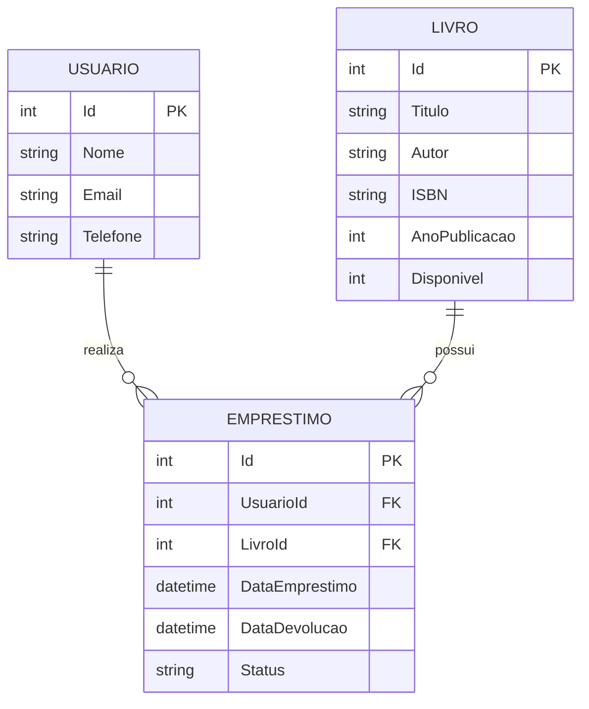

# 📚 Gerenciador de Livro API

API RESTful para gerenciamento de bibliotecas, desenvolvida com ASP.NET Core e Entity Framework Core, aplicando os princípios de Clean Architecture e design patterns modernos.

## 🚀 Sobre o Projeto

Esta API fornece funcionalidades completas para gestão de bibliotecas, incluindo cadastro de livros, usuários e controle de empréstimos. O projeto foi desenvolvido como demonstração de conhecimentos em arquitetura de software, padrões de projeto e boas práticas de desenvolvimento back-end.

## ✨ Funcionalidades

- **Gerenciamento de Livros**: CRUD completo (criar, listar, buscar por ID, atualizar e deletar)
- **Gerenciamento de Usuários**: Cadastro e consulta de usuários do sistema
- **Controle de Empréstimos**: Registro e acompanhamento de empréstimos de livros
- **Validação de Disponibilidade**: Verificação automática de disponibilidade de livros
- **Documentação Interativa**: Interface Scalar para exploração da API

## 🏗️ Arquitetura

O projeto segue os princípios de **Clean Architecture**, organizado em 4 camadas:

├── GerenciadorLivro.API # Camada de apresentação (Controllers, configuração)
├── GerenciadorLivro.Application # Camada de aplicação (Services, DTOs, Result Pattern)
├── GerenciadorLivro.Core # Camada de domínio (Entities, Interfaces, Regras de negócio)
└── GerenciadorLivro.Infrastructure # Camada de infraestrutura (Repositories, DbContext, Migrations)

### Separação de Responsabilidades

- **API Layer**: Gerencia requisições HTTP, validações de entrada e retorno de respostas
- **Application Layer**: Contém lógica de aplicação, orquestração de serviços e transformação de dados
- **Core (Domain) Layer**: Define entidades de domínio, interfaces e regras de negócio puras
- **Infrastructure Layer**: Implementa acesso a dados, persistência e integrações externas

## 🛠️ Tecnologias Utilizadas

- **.NET 10.0** - Framework principal
- **ASP.NET Core** - API Web Framework
- **Entity Framework Core** - ORM para acesso a dados
- **SQL Server** - Banco de dados relacional
- **Scalar** - Documentação interativa de API (OpenAPI)
- **Dependency Injection** - Gerenciamento de dependências nativo do ASP.NET Core

## 📐 Padrões de Projeto Implementados

### Repository Pattern
Abstração da camada de acesso a dados através de interfaces no domínio e implementações na infraestrutura:
```csharp
public interface ILivroRepository
{
    Task<List<Livro>> GetAll();
    Task<Livro?> GetById(int id);
    Task<int> Add(Livro livro);
    Task Update(Livro livro);
    Task Delete(int id);
}
```
### Result Pattern
Padronização de respostas da API para facilitar tratamento de erros:
```csharp
public class ResultViewModel<T>
{
    public bool IsSuccess { get; set; }
    public string Message { get; set; }
    public T? Data { get; set; }
}
```
### Dependency Injection
Desacoplamento de dependências através de injeção via constructor e extension methods para organização.

### 📦 Estrutura de Entidades


### 🚀 Como Executar

Pré-requisitos
- .NET 9.0 SDK

- SQL Server (LocalDB, Express ou versão completa)

- IDE: Visual Studio 2022 ou VS Code

Configuração
1. **Clone o repositório**
```
git clone https://github.com/Bruno-Regis/Projeto-Gerenciador-Livro-API.git
cd Projeto-Gerenciador-Livro-API
```

2. **Configure a connection string**

Edite o arquivo appsettings.json na camada API:
```
{
  "ConnectionStrings": {
    "DefaultConnection": "Server=(localdb)\\mssqllocaldb;Database=GerenciadorLivrosDb;Trusted_Connection=True;TrustServerCertificate=True"
  }
}
```
3. **Execute as migrations**
```
cd GerenciadorLivro.Infrastructure
dotnet ef database update --startup-project ../GerenciadorLivro.API
```
4. **Execute o projeto**
```
cd ../GerenciadorLivro.API
dotnet run
```
5. **Acesse a documentação**
Abra o navegador em: https://localhost:7205/scalar/v1 (ou porta configurada)

### 📖 Endpoints Principais
Livros

GET /api/livros - Lista todos os livros

GET /api/livros/{id} - Busca livro por ID

POST /api/livros - Cadastra novo livro

PUT /api/livros/{id} - Atualiza livro existente

DELETE /api/livros/{id} - Remove livro

Usuários

GET /api/usuarios - Lista todos os usuários

GET /api/usuarios/{id} - Busca usuário por ID

POST /api/usuarios - Cadastra novo usuário

PUT /api/usuarios/{id} - Atualiza usuário

Empréstimos

GET /api/emprestimos - Lista todos os empréstimos

GET /api/emprestimos/{id} - Busca empréstimo por ID

POST /api/emprestimos - Registra novo empréstimo

PUT /api/emprestimos/{id}/devolver - Registra devolução

👨‍💻 Autor
Bruno Regis

[]([https://www.linkedin.com/in/seu-usuario-linkedin](https://www.linkedin.com/in/bruno-regis-borges-da-costa-netto))
